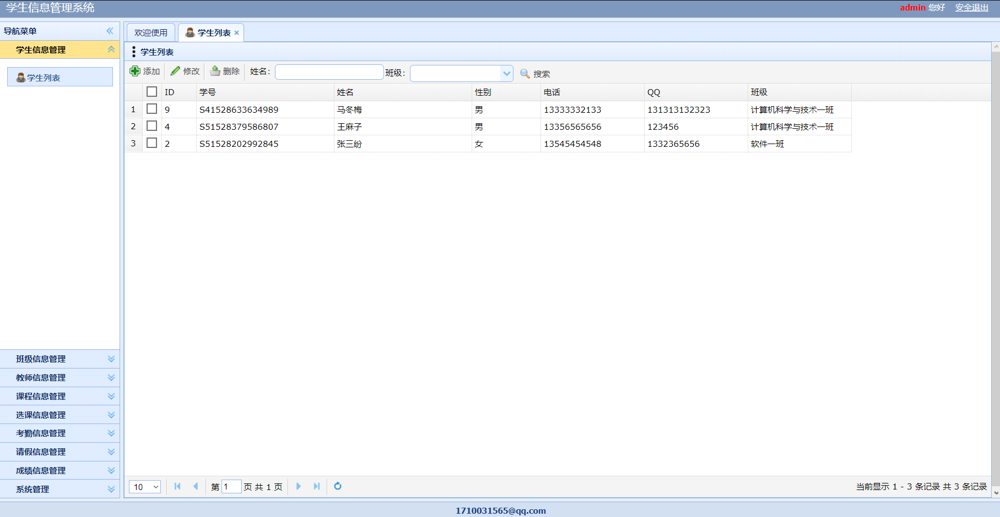

## 基于SpringBoot的学生信息管理系统

###  获取sql数据库文件: 从戎源码网 (https://armycodes.com/) QQ: 386869957 QQ群: 377586148
###  所有系统地址: (https://github.com/YuLin-Coder/AllProjectCatalog) 
###  所有项目以及源代码本人均调试运行无问题 可支持远程安装部署调试、定制修改、代码讲解

## 项目介绍
基于SpringBoot的学生信息管理系统，本系统共分为3个角色：系统管理员、学生、教师，主要功能如下

### 【管理员】:
1. 学生信息管理：管理员可以查看学生列表，并进行学生信息的管理，包括添加、编辑、删除学生信息。
2. 班级信息管理：管理员可以查看班级列表，并进行班级信息的管理，包括添加、编辑、删除班级信息。
3. 教师信息管理：管理员可以查看教师列表，并进行教师信息的管理，包括添加、编辑、删除教师信息。
4. 课程信息管理：管理员可以查看课程列表，并进行课程信息的管理，包括添加、编辑、删除课程信息。
5. 选课信息管理：管理员可以查看学生的选课情况，并进行选课信息的管理，包括添加、删除选课信息。
6. 考勤信息管理：管理员可以查看学生的考勤情况，并进行考勤信息的管理，包括添加、编辑、删除考勤信息。
7. 请假信息管理：管理员可以查看学生的请假申请，并进行请假信息的管理，包括批准、拒绝请假申请。
8. 成绩信息管理：管理员可以录入学生的成绩，包括考试成绩、作业成绩等。
9. 系统管理：管理员可以管理系统的基本设置，包括修改管理员账号密码、备份数据库等操作。

### 【学生】:
1. 学生信息管理：学生可以查看和修改自己的个人信息，包括姓名、学号、性别等。
2. 选课信息管理：学生可以查看可选课程列表，并选择自己感兴趣的课程进行选课。
3. 考勤信息管理：学生可以查看自己的考勤记录，包括上课签到情况等。
4. 请假信息管理：学生可以提交请假申请，包括请假日期、请假原因等。
5. 成绩信息管理：学生可以查看自己的成绩和成绩详情，包括考试成绩、作业成绩等。
6. 系统管理：学生可以修改自己的登录密码和联系方式等。

### 【教师】:
1. 学生信息管理：教师可以查看学生列表，并进行学生信息的管理，包括添加、编辑、删除学生信息。
2. 班级信息管理：教师可以查看班级列表，并进行班级信息的管理，包括添加、编辑、删除班级信息。
3. 教师信息管理：教师可以查看和修改自己的个人信息，包括姓名、教工号、性别等。
4. 课程信息管理：教师可以查看课程列表，并进行课程信息的管理，包括添加、编辑、删除课程信息。
5. 选课信息管理：教师可以查看学生的选课情况，并进行选课信息的管理，包括添加、删除选课信息。
6. 考勤信息管理：教师可以查看学生的考勤情况，并进行考勤信息的管理，包括添加、编辑、删除考勤信息。
7. 请假信息管理：教师可以查看学生的请假申请，并进行请假信息的管理，包括批准、拒绝请假申请。
8. 成绩信息管理：教师可以录入学生的成绩，包括考试成绩、作业成绩等。
9. 系统管理：教师可以修改自己的登录密码和联系方式等。

## 项目技术
- 编程语言：Java
- 数据库：MySQL
- 项目管理工具：Maven
- 前端技术：html、Jquery、CSS、JavaScript
- 后端技术：Spring、SpringMVC、MyBatis

## 运行环境
- JDK版本：JDK1.8及以上
- 开发工具：IDEA、Ecplise、Myecplise都可以
- 数据库: MySQL5.7及以上
- Maven：maven3.0及以上

## 运行截图

